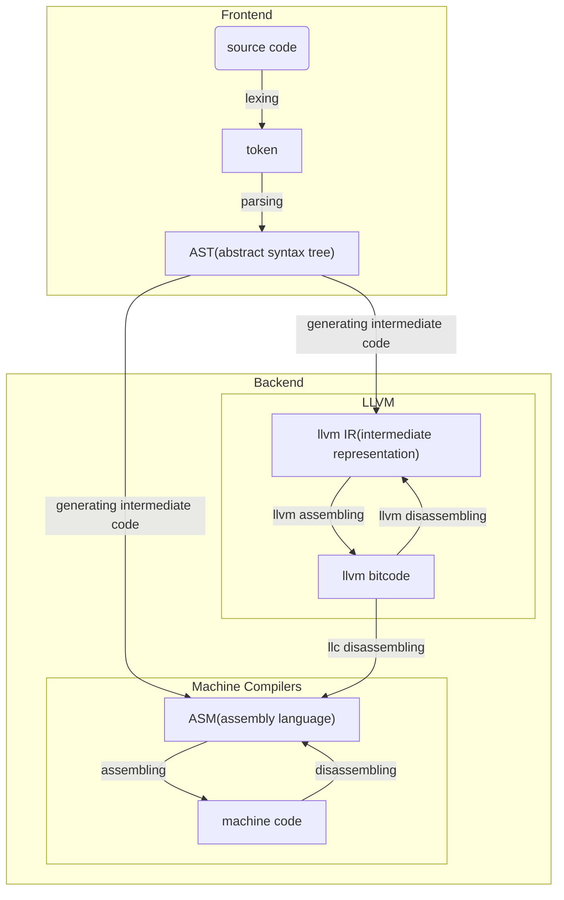

LLVM教学跟练代码，实现Kaleidoscope语言. LLVM tutorial <https://llvm.org/docs/tutorial>.

# Tools Version
GCC/G++: version Ubuntu 9.1.0

Clang/Clang++: version 9.0.0

LLVM/LLVM-C: 9.0.0

# Directories Description
## src
Main source code to implement Kaleidoscope.
## include
Dependence headers, including llvm/llvm-c headers.
## llvm_test
Some scattered small projects to validate the application of LLVM.

# 笔记
## 编译原理
### 编译过程
预处理阶段：将主文件（编译对象）与引用的文件整合（超级长的C++代码），"#include", Optimization(-OX)在这个阶段发挥作用。

编译阶段：将C++代码转换为汇编代码，"-g"选项在这个阶段发挥作用，将符号表嵌入汇编代码中。

汇编阶段：将多个目标文件（包括编译阶段生成的用户目标文件，和编译器库自带的静态目标文件）合并为一个可执行文件。

加载阶段（执行阶段）：这一步执行可执行文件，在执行过程中加载需要的动态目标文件，"DllImport"在这一阶段发挥作用。

### Constant Folding -- An Optimization Tech
Folded constant:
```
ready> def test(x) 1+2+x;
Read function definition:
define double @test(double %x) {
entry:
    %addtmp = fadd double 3.000000e+00, %x
    ret double %addtmp
}
```
Unfolded constant:
```
ready> def test(x) 1+2+x;
Read function definition:
define double @test(double %x) {
entry:
    %addtmp = fadd double 2.000000e+00, 1.000000e+00
    %addtmp1 = fadd double %addtmp, %x
    ret double %addtmp1
}
```
Constant folding, as seen above, in particular, is a very common and very important optimization. It help reduce the number of instructions.

## LLVM
### Workflow of Compiling

### LLVM IR
IR（immediately representation）是LLVM的一种中间代码

### LLVM Pass
Pass is an optimization technique that boost performance of IR. In CLI, using opt command to apply pass.

The optimization techniques including:
1. Constant folding.
2. Loops folding.
...

### LLVM Elements
#### LLVMContext
LLVMContext is an opaque class in the LLVM API which clients can use to operate multiple, isolated instances of LLVM concurrently within the same address space. For instance, in a hypothetical compile-server, the compilation of an individual translation unit is conceptually independent from all the others, and it would be desirable to be able to compile incoming translation units concurrently on independent server threads. Fortunately, LLVMContext exists to enable just this kind of scenario!

Conceptually, LLVMContext provides isolation. Every LLVM entity (Modules, Values, Types, Constants, etc.) in LLVM’s in-memory IR belongs to an LLVMContext. Entities in different contexts cannot interact with each other: Modules in different contexts cannot be linked together, Functions cannot be added to Modules in different contexts, etc. What this means is that is safe to compile on multiple threads simultaneously, as long as no two threads operate on entities within the same context.

In practice, very few places in the API require the explicit specification of a LLVMContext, other than the Type creation/lookup APIs. Because every Type carries a reference to its owning context, most other entities can determine what context they belong to by looking at their own Type. If you are adding new entities to LLVM IR, please try to maintain this interface design.

LLVMContext是LLVM API中的一个不透明类，客户端可以使用它在同一地址空间内同时操作LLVM的多个独立实例。例如，在假设的编译服务器中，单个翻译单元的编译在概念上独立于所有其他翻译单元，并且希望能够在独立的服务器线程上同时编译传入的翻译单元。幸运的是，LLVMContext的存在正是为了启用这种场景！

从概念上讲，LLVMContext提供了隔离。LLVM的内存中IR中的每个LLVM实体（模块、值、类型、常量等）都属于LLVMContext。不同上下文中的实体不能相互作用：不同上下文中的模块不能链接在一起，函数不能添加到不同上下文中的模块中，等等。这意味着，只要同一上下文中的实体上没有两个线程操作，就可以安全地在多个线程上同时编译。

实际上，除了类型创建/查找API之外，API中很少有地方需要LLVMContext的显式规范。因为每个类型都带有对其所属上下文的引用，所以大多数其他实体可以通过查看自己的类型来确定它们属于哪个上下文。如果要向LLVM IR添加新实体，请尝试维护此接口设计。

#### BasicBlock
A basic block is simply a container of instructions that execute sequentially. Basic blocks are Values because they are referenced by instructions such as branches and switch tables. The type of a BasicBlock is "Type::LabelTy" because the basic block represents a label to which a branch can jump.

A well formed basic block is formed of a list of non-terminating instructions followed by a single TerminatorInst instruction. TerminatorInst's may not occur in the middle of basic blocks, and must terminate the blocks. The BasicBlock class allows malformed basic blocks to occur because it may be useful in the intermediate stage of constructing or modifying a program. However, the verifier will ensure that basic blocks are "well formed".

基本块只是顺序执行的指令的容器。基本块是值，因为它们被分支和开关表等指令引用。BasicBlock的类型是“type：：LabelTy”，因为基本块表示分支可以跳转到的标签。

格式良好的基本块由一系列非终止指令和一条终止指令组成。TerminatorInst不能出现在基本块的中间，必须终止块。BasicBlock类允许出现格式错误的基本块，因为它可能在构建或修改程序的中间阶段有用。然而，验证器将确保基本块是“格式良好的”。

#### IRBuilder
The IRBuilder is a convenience class that can be used to add several instructions to the end of a BasicBlock or before a particular Instruction. It also supports constant folding and renaming named registers.

IRBuilder是一个方便的类，可用于将多条指令添加到BasicBlock的末尾或特定指令的前面。它还支持常量折叠和重命名命名寄存器

The example below demonstrates a very simple use of the IRBuilder where three instructions are inserted before the instruction pi. The first two instructions are Call instructions and third instruction multiplies the return value of the two calls.

下面的示例演示了IRBuilder的一个非常简单的用法，其中在指令pi之前插入了三条指令。前两条指令是调用指令，第三条指令将两次调用的返回值相乘。 

```c++
Instruction *pi = ...;
IRBuilder<> Builder(pi);
CallInst* callOne = Builder.CreateCall(...);
CallInst* callTwo = Builder.CreateCall(...);
Value* result = Builder.CreateMul(callOne, callTwo);
```

The example below is similar to the above example except that the created IRBuilder inserts instructions at the end of the BasicBlock pb.

下面的示例与上面的示例类似，只是创建的IRBuilder在BasicBlock pb的末尾插入指令。

```c++
BasicBlock *pb = ...;
IRBuilder<> Builder(pb);
CallInst* callOne = Builder.CreateCall(...);
CallInst* callTwo = Builder.CreateCall(...);
Value* result = Builder.CreateMul(callOne, callTwo);
```

#### Module
The Module class represents the top level structure present in LLVM programs. An LLVM module is effectively either a translation unit of the original program or a combination of several translation units merged by the linker. The Module class keeps track of a list of Functions, a list of GlobalVariables, and a SymbolTable. Additionally, it contains a few helpful member functions that try to make common operations easy.

Module类表示LLVM程序中存在的顶级结构。LLVM模块实际上是原始程序的翻译单元，或者是链接器合并的几个翻译单元的组合。Module类跟踪函数列表、全局变量列表和符号表。此外，它还包含一些有用的成员函数，这些函数试图简化常见操作。

A Module instance is used to store all the information related to an LLVM module. Modules are the top level container of all other LLVM
Intermediate Representation (IR) objects. Each module directly contains a list of globals variables, a list of functions, a list of libraries (or other modules) this module depends on, a symbol table, and various data about the target's characteristics.

A module maintains a GlobalValRefMap object that is used to hold all
constant references to global variables in the module. When a global
variable is destroyed, it should have no entries in the GlobalValueRefMap. The main container class for the LLVM Intermediate Representation.

模块实例用于存储与LLVM模块。模块是所有其他LLVM的顶级容器中间表示（IR）对象。每个模块直接包含全局变量列表、函数列表、此模块所依赖的库（或其他模块）列表、符号表和有关目标特性的各种数据。

模块维护用于保存所有对模块中全局变量的常量引用。当一个全球性的变量已销毁，它在GlobalValueRefMap中不应有任何条目。LLVM中间表示的主容器类。

#### Value
It is the base class of all values computed by a program that may be used as operands to other values. Value is the super class of other important classes such as Instruction and Function. All Values have a Type. Type is not a subclass of Value. Some values can have a name and they belong to some Module. Setting the name on the Value automatically updates the module's symbol table.

Every value has a "use list" that keeps track of which other Values are using this Value. A Value can also have an arbitrary number of ValueHandle objects that watch it and listen to RAUW and Destroy events. See llvm/IR/ValueHandle.h for details.

它是由程序计算的所有值的基类，可以用作其他值的操作数。值是其他重要类（如指令类和函数类）的超类。所有值都有一个类型。类型不是值的子类。有些值可以有一个名称，它们属于某个模块。在值上设置名称会自动更新模块的符号表。

每个值都有一个“使用列表”，用于跟踪其他哪些值正在使用此值。一个值也可以有任意数量的ValueHandle对象，这些对象监视它并监听RAUW和Destroy事件。有关详细信息，请参见llvm/IR/ValueHandle.h。

## C++用法
### nullptr
空指针
### Prototype for a function（函数原型）
C++中的函数原型就是函数声明，将函数的名字、类型、个数和顺序通知给编译系统，以便调用函数时对照检查
### 函数参数传值与传地址
传值需要额外开辟空间来存储临时变量，开销较大，且参数只能作为输入参数。
传地址不需要额外开辟空间，效率较高，参数可作为输出参数。
### const妙用
一个函数如果其输入参数采用“指针传递”，那么加const修饰可防止意外地改动该指针。
特别注意参数加const后不能当输出参数用。

如果函数的返回值为指针形式，用const修饰返回值可使函数返回的值（指针）不能被修改。
### auto
相当于一个“万能类型”。auto a = b; a的类型取决于b。有点像CSharp中的var类型。
### utility.std::move（移动）
a = std::move(b)：将b指向的值赋给a，同时释放b的内存
### memory.std::unique_ptr（唯一指针）
指针在创建时必须指定指向的对象，并且不同的指针不能指向同一个对象
### override
C++ 11 standard, indicating that a virtual function must be rewritten.

# Troubleshoot
## error LNK2001
F:\projects\Cpp\LLVM_tutorial>call clang++ build/kaleidoscope_main.o -o bin/kaleidoscope_main.exe -L lib   && (goto link_succed )  || goto link_failed

kaleidoscope_main.o : error LNK2001: 无法解析的外部符号 "public: virtual class llvm::Value * __cdecl VariableExprAST::codegen(void)" (?codegen@VariableExprAST@@UEAAPEAVValue@llvm@@XZ)

kaleidoscope_main.o : error LNK2001: 无法解析的外部符号 "public: virtual class llvm::Value * __cdecl CallExprAST::codegen(void)" (?codegen@CallExprAST@@UEAAPEAVValue@llvm@@XZ)

kaleidoscope_main.o : error LNK2001: 无法解析的外部符号 "public: virtual class llvm::Value * __cdecl NumberExprAST::codegen(void)" (?codegen@NumberExprAST@@UEAAPEAVValue@llvm@@XZ)

kaleidoscope_main.o : error LNK2001: 无法解析的外部符号 "public: virtual class llvm::Value * __cdecl BinaryExprAST::codegen(void)" (?codegen@BinaryExprAST@@UEAAPEAVValue@llvm@@XZ)

bin/kaleidoscope_main.exe : fatal error LNK1120: 4 个无法解析的外部命令

### solving LNK2001
1. Add linking option "`llvm-config --cxxflags --ldflags --system-libs --libs core`" in build files, then it comes the error "Link error: Cannot find -Ltinfo...".

2. In Ubuntu 16.04 terminal, use command "sudo apt-get install libtinfo-dev" to install ltinfo. See <https://www.e-learn.cn/content/wangluowenzhang/819973>